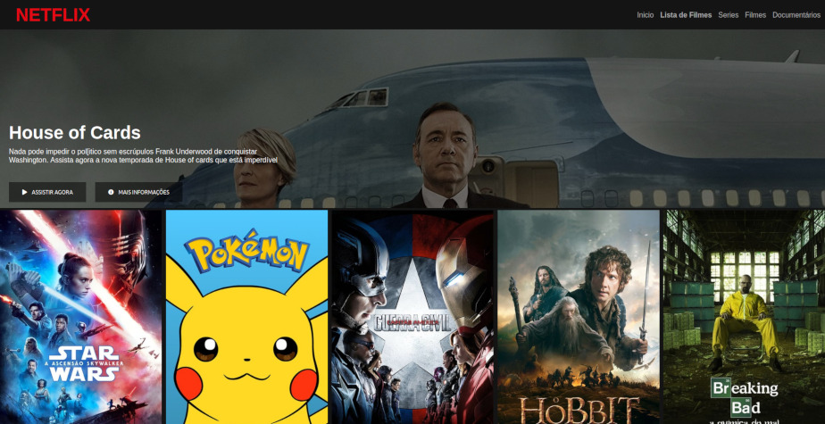
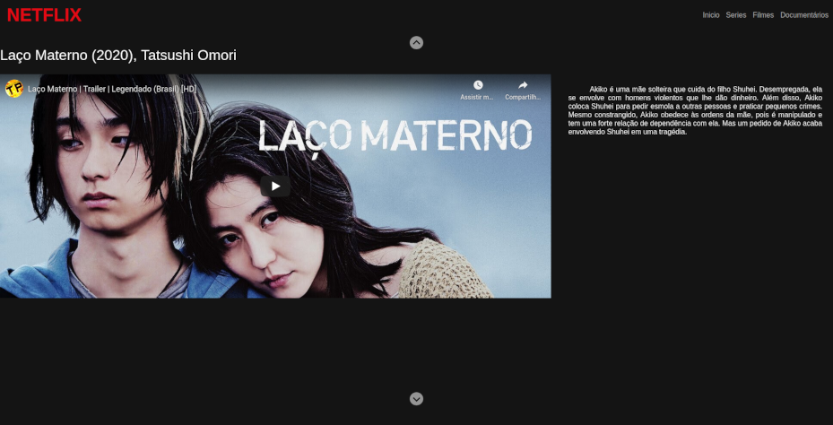

# Repilica  da Interface da Netflix .

Projeto criado com base no projeto "Recriando a Interface do Netflix" do professor Felipe Aguiar, da Digital Innovation One
## Caracteristicas do Projeto
Adicionei na plataforma uma lista de trailers de filmes disponibilidados na netflix que lançaram em 2020 que eu quero ver até o final do ano. Para fazer a transição de filmes usei a ferramenta Splide.js em vez de usar o Owl e coloquei os videos dos trailers faznedo um embeed pelo youtube. 
- Responsivo
- Biblioteca Splide.js para o carrosel
- Embeed de vídeos para mostrar os trailers

